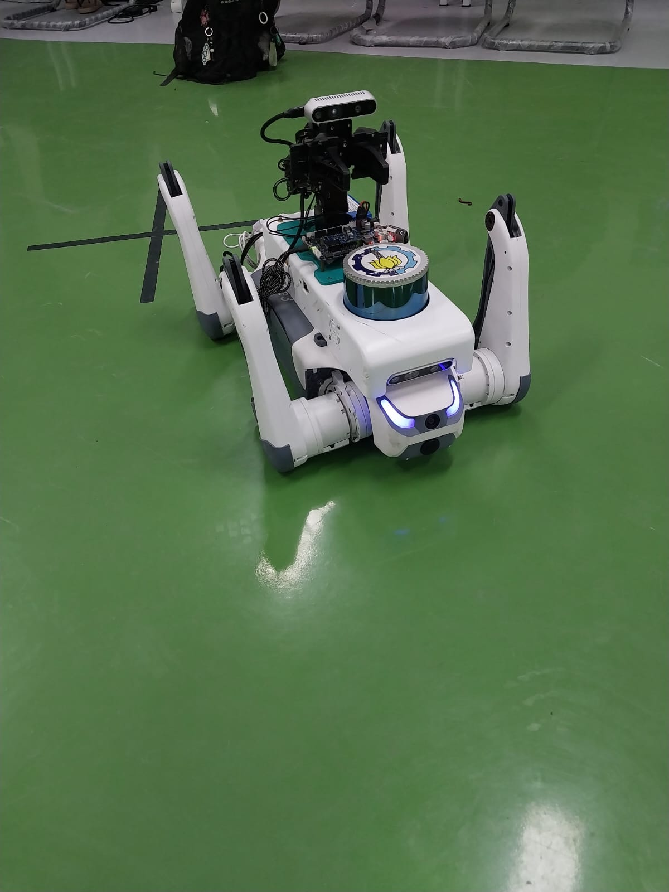
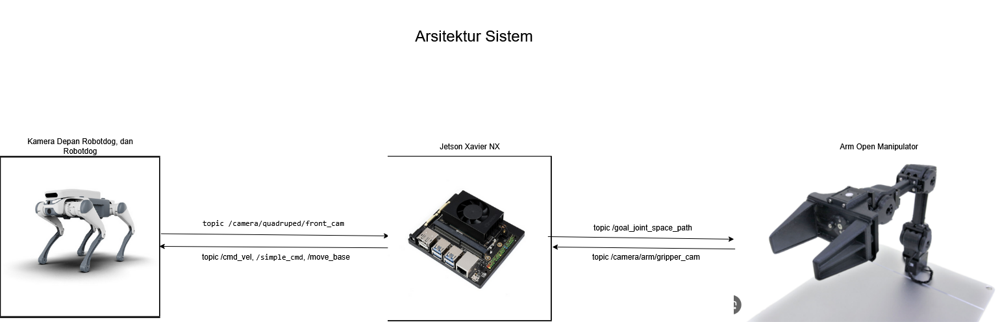
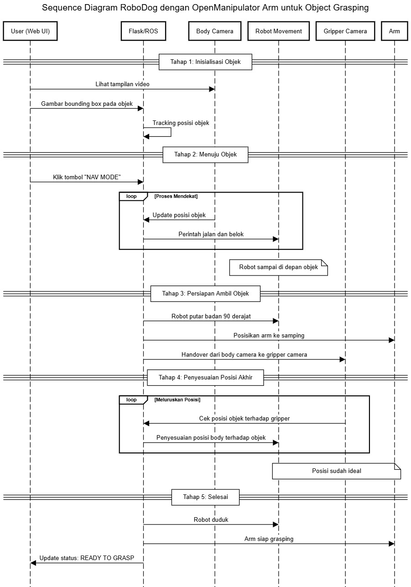
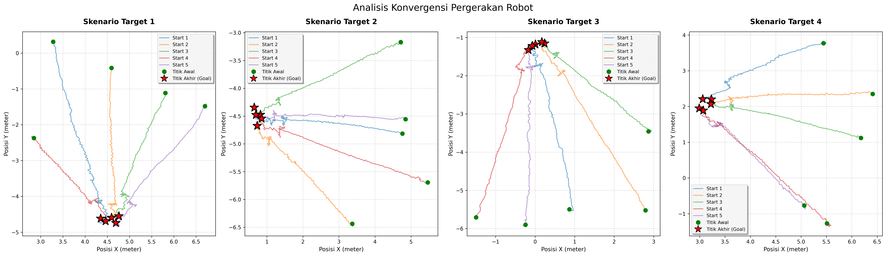
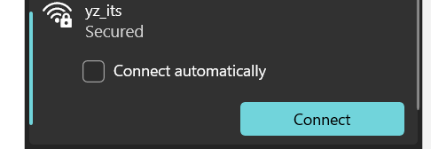

# Penerapan IBVS pada Robot Dog Lite-3 dengan OpenManipulator

Pada projek ini dilakukan penerapan Image-Based Visual Servo (IBVS) pada Robot Dog lite-3 dan dengan tangan yang menggunakan OpenManipulator.



## 1. Arsitektur Komunikasi Sistem

Sistem berjalan terpusat pada **NVIDIA Jetson Xavier NX** yang bertindak sebagai "otak", menghubungkan dua subsistem hardware utama:

* **Robot Dog (Kaki):** Menerima perintah kecepatan dan mode gerak.
* **OpenManipulator (Tangan):** Menerima target sudut sendi untuk pergerakan.

### Alur Data Utama:

1.  **Input Visual:** Citra dari *Kamera Depan* dan *Kamera Gripper* masuk ke Jetson.
2.  **Processing (Python Node):** Jetson memproses gambar, menghitung error posisi target, dan menentukan aksi selanjutnya.
3.  **Command Output:**
    * Navigasi Jarak Jauh: Mengirim data ke `move_base`.
    * Koreksi Posisi (Tracking): Mengirim `cmd_vel` ke robot dog.
    * Eksekusi Grasping: Mengirim trigger ke node `navman`.

---

## 2. Mekanisme Alur Kerja

Mekanisme robot dibagi menjadi 4 fase utama sesuai dengan perubahan *State Machine*:

### FASE 1: Navigasi Global (State: NAVIGATING)
* **Mekanisme:** User memilih tujuan di Web Dashboard.
* **Proses:** Node Python mengirim koordinat (x, y) ke *Move Base*. Robot menggunakan sensor Lidar/Odometri untuk berjalan otomatis menghindari rintangan menuju titik tersebut.
* **Hasil:** Robot sampai di lokasi dan masuk ke mode `SEARCHING` (diam menunggu input).

### FASE 2: Visual Servoing Jarak Jauh (State: TRACKING)
* **Mekanisme:** Operator menggambar kotak (Bounding Box) pada objek di video stream *Kamera Depan*.
* **Proses:**
    * Sistem mengunci objek menggunakan algoritma CSRT Tracker.
    * Menghitung titik tengah objek ($C_x, C_y$).
    * Menggunakan **PID Controller** untuk memutar robot (agar $C_x$ di tengah layar) dan memajukan robot.
* **Transisi:** Ketika objek terdeteksi sudah sangat dekat (melewati batas bawah layar), robot berhenti otomatis.

### FASE 3: Manuver Rotasi & Transisi (State: MANEUVER)
* **Masalah:** Lengan robot terpasang di punggung/samping, sehingga tidak bisa mengambil objek yang tepat berada di depan wajah robot.
* **Mekanisme:**
    1.  Robot melakukan rotasi badan 90 derajat (Hardcoded/IMU based).
    2.  Sistem mematikan *Kamera Depan* dan mengaktifkan *Kamera Gripper* (kamera di ujung tangan).
    3.  Lengan bergerak ke posisi siaga (`POSE_ROTATE_LEFT`).

### FASE 4: Penyelarasan & Eksekusi (State: ALIGNING -> GRASPING)
* **Alignment (Penyelarasan):**
    * Menggunakan *Kamera Gripper*, robot melihat objek dari atas/samping.
    * Robot melakukan gerakan geser samping hingga gripper hingga tegak lurus dengan objek.
    * Setelah posisi pas, robot mengirim perintah **Duduk (SIT)** untuk mengunci posisi agar stabil.
* **Handover ke C++:**
    * Operator melakukan konfirmasi final di Web.
    * Python mengirim sinyal `True` ke topik `/navman_comm`.
    * **Node C++** mengambil alih kendali penuh untuk menghitung *Inverse Kinematics* dan menutup gripper.

---

## 3. State Machine

| Kode State | Nama State | Fungsi Utama | Kamera Aktif |
| :--- | :--- | :--- | :--- |
| `0` | **IDLE** | Robot diam, menunggu perintah misi. | Body |
| `1` | **NAVIGATING** | Robot berjalan ke lokasi peta (Autonomous). | Body |
| `3` | **TRACKING** | Mengejar objek visual dari jauh. | Body |
| `4` | **MANEUVER** | Robot berputar 90° untuk memposisikan lengan. | - |
| `5` | **ALIGNING** | Robot geser samping untuk meluruskan gripper. | Gripper |
| `6` | **READY** | Robot duduk, menunggu konfirmasi operator. | Gripper |
| `7` | **GRASPING** | Logika C++ mengambil alih untuk menjepit objek. | - |

---

## 4. Diagram Sistem

Berikut adalah gambar Arsitektur sistem dan Sequence Diagram dari Robot Dog.

### Arsitektur Sistem


### Flowchart


### Sequence Diagram



## 5. Hasil Percobaan

### Percobaan pergerakan robot dengan variasi 4 posisi benda yang berbeda dan setiap posisi dilakukan percobaan 5 kali dengan posisi start robot yang berbeda.



Berdasarkan grafik trajektori di atas, terlihat bahwa program berhasil menuntun robot menuju titik target yang konvergen, meskipun diinisialisasi dari berbagai posisi awal yang berbeda. Hal ini membuktikan kemampuan robot dalam melakukan navigasi visual yang konsisten.

Sedikit variasi yang terlihat pada titik akhir ($Goal$) disebabkan oleh proses *alignment* gripper. Robot menyesuaikan orientasi akhirnya berdasarkan deteksi visual dari *Gripper Camera* secara real-time, sehingga posisi final robot bersifat dinamis menyesuaikan postur terbaik untuk melakukan grasping.


## 6. Cara Menjalankan Program

> [!NOTE]
> Disarankan menggunakan Linux ataupun jika pada windows gunakan WSL.

1.  Pastikan device terhubung ke Wi-Fi `yz_its`.
   
    

3.  Buka terminal dan masukkan command untuk SSH:
    ```bash
    ssh ysc@192.168.1.103
    ```

4.  **Persiapan Environment (Wajib)**
> [!IMPORTANT]
> Untuk setiap terminal baru harus menjalankan langkah ini selalu.

    Aktifkan environment `conda` dan lakukan sourcing workspace ROS:
    ```bash
    srconda
    conda activate robotdog
    cd ~/lite_cog/camera/
    source devel/setup.bash
    ```

4.  **Terminal 1:** ROS bridge dan video server (Jembatan komunikasi antara ROS dan Web Interface).
    ```bash
    roslaunch my_command_quadruped rosbridge_webvideoserver.launch
    ```

5.  **Terminal 2:** Web Interface Hosting (Menjalankan server HTTP untuk frontend).
    ```bash
    cd src/my_interface/
    python3 -m http.server 8000
    ```

6.  **Terminal 3:** Mengaktifkan service Lidar.
    ```bash
    cd ~/lite_cog/system/scripts/lidar
    ./start_lslidar.sh
    ```

7.  **Terminal 4:** Mengaktifkan service navigasi.
    ```bash
    cd ~/lite_cog/system/scripts/nav
    # Pilih salah satu skrip di bawah:
    ./start_nav.sh
    # ATAU
    ./start_nav_map_tf.sh
    ```

8.  **Terminal 5:** Mengaktifkan kamera robot dog.
    ```bash
    roslaunch my_command_quadruped all_cam_utilities.launch
    ```

9.  **Terminal 6:** Mengaktifkan kamera OpenManipulator.
    ```bash
    roslaunch my_graspnet_ros all_cam_utilities.launch
    ```

10. **Terminal 7:** Menjalankan controller untuk OpenManipulator.
    ```bash
    ./src/my_command_arm/bash_scripts/controller_custom.sh
    ```

11. **Terminal 8:** Menjalankan program manipulasi.
    ```bash
    roslaunch my_command_arm my_manipulation.launch
    ```

12. **Terminal 9:** Menjalankan navigasi.
    ```bash
    roslaunch my_command_quadruped my_navigation.launch
    ```

> [!TIP]
> Tidak perlu menjalankan semua service, cukup service yang diperlukan saja.

### Menjalankan Program Utama

Setelah mengaktifkan service yang diperlukan, program baru bisa dijalankan. Program terletak pada folder:

```bash
cd ~/Documents/test
```

Untuk menjalankan program gunakan
```bash
python3 ibvs_program.py
```

## 7. Video Demo

### Video Demo
[)
